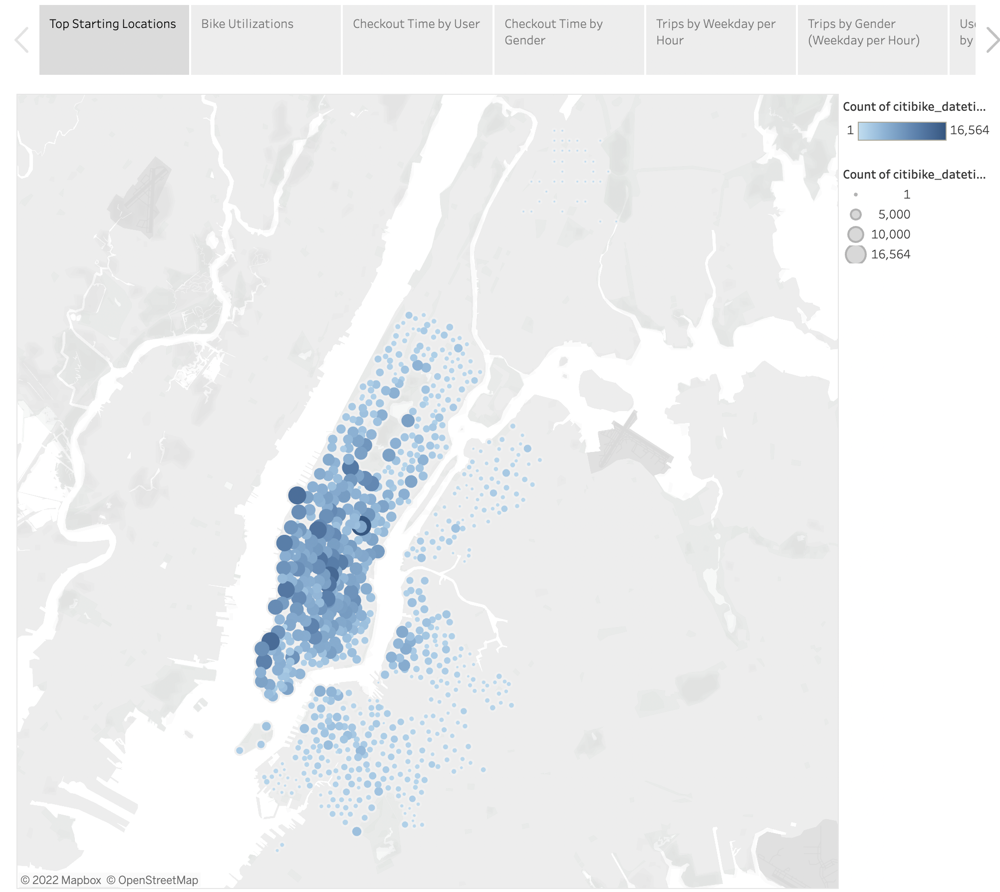
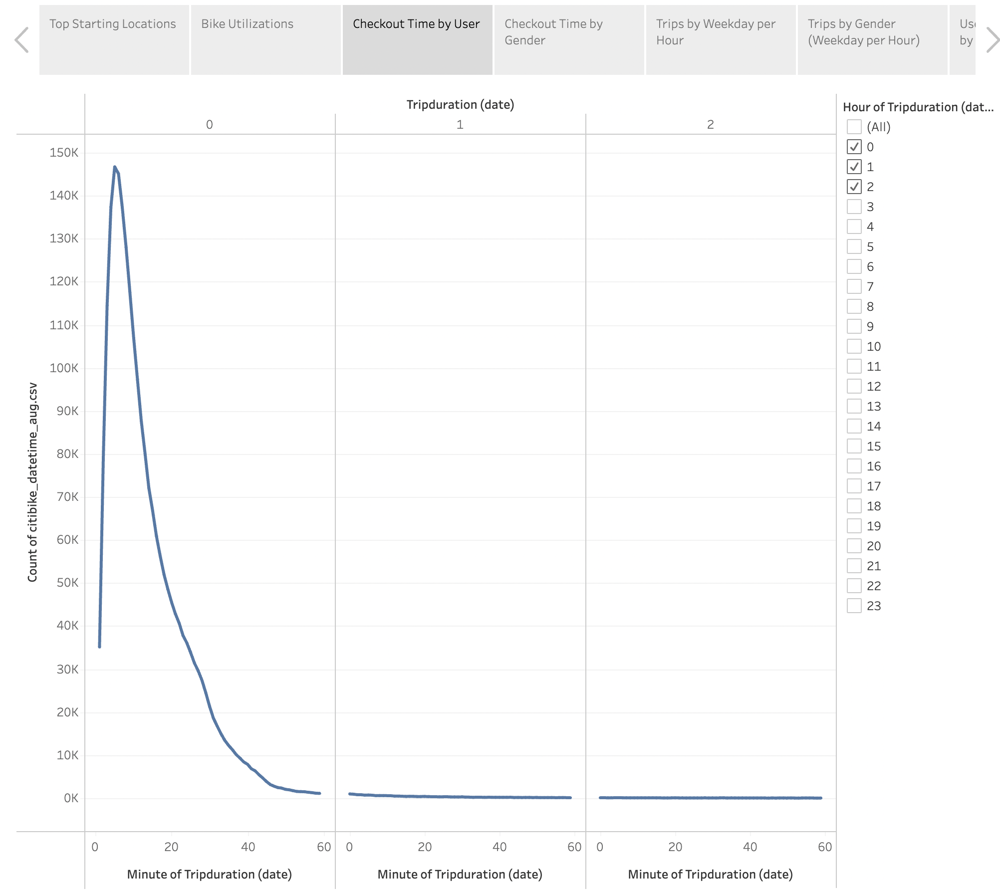
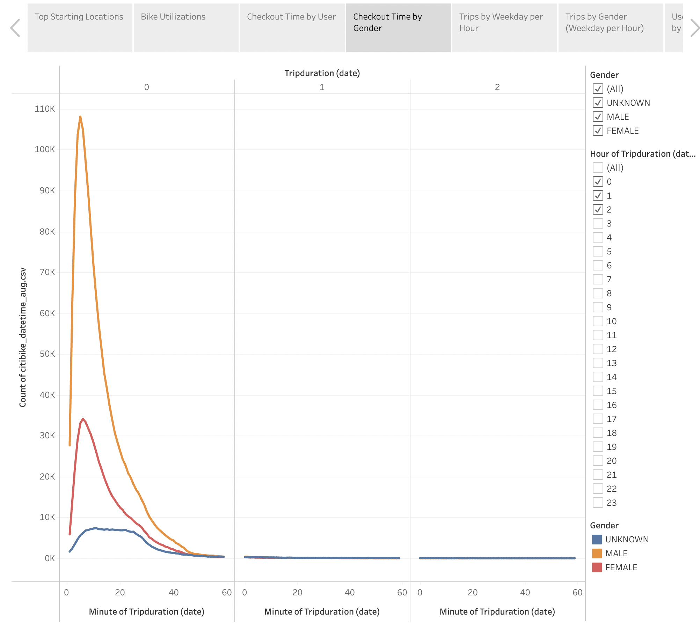
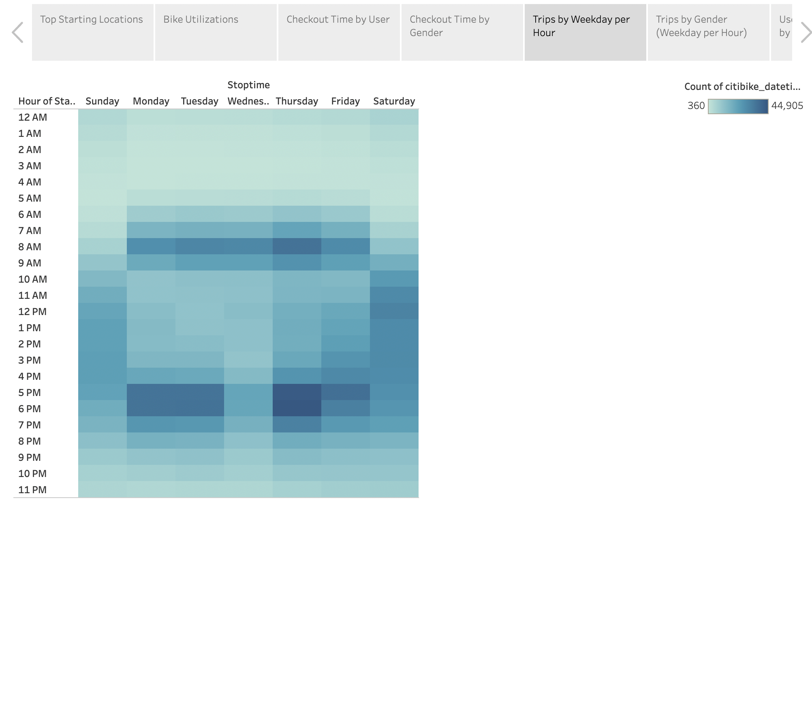
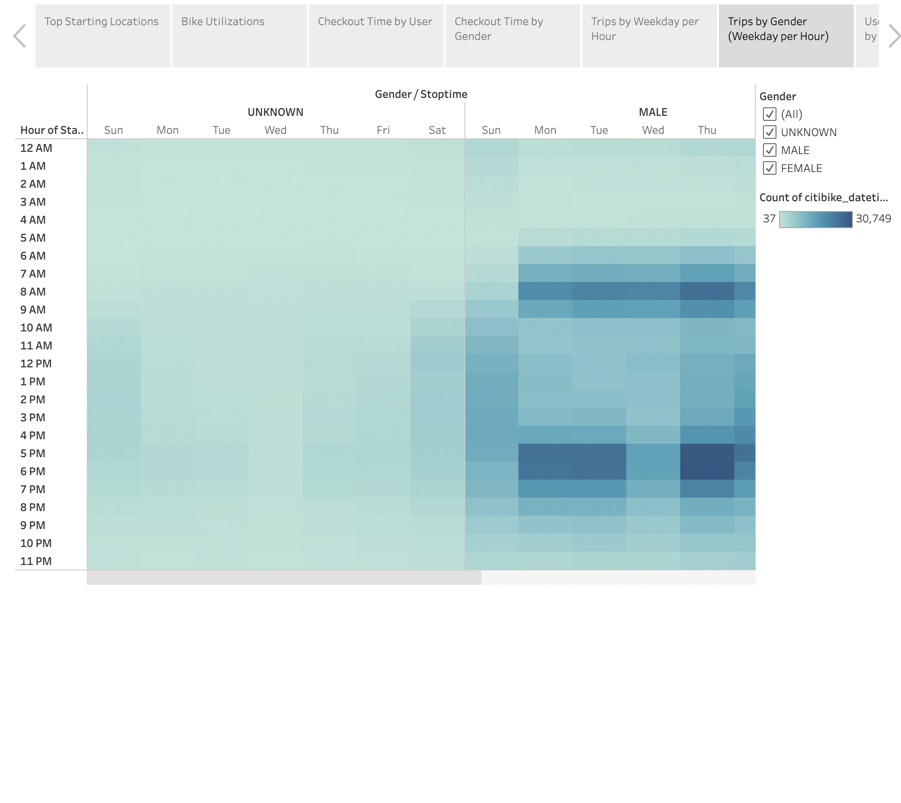
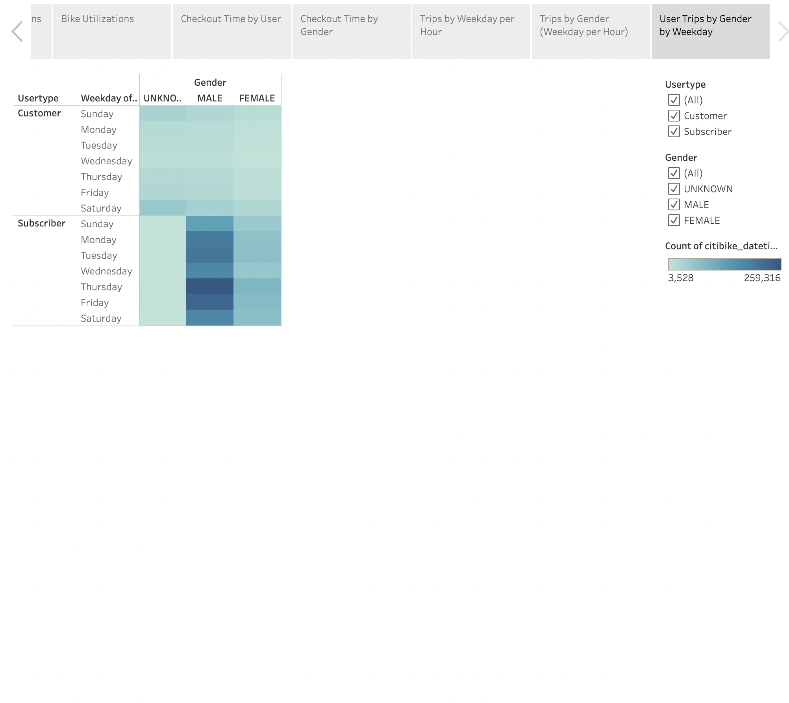

# bikesharing

[link to dashboard](https://public.tableau.com/app/profile/meg7530/viz/NYC_CitiBikes_16642028662200/NYCCitiBikes?publish=yes)

## Overview
The purpose of this analysis is to define and determine what months of the year a bike sharing business would be most successful, as well as what demographic groups it would be most successful with.

## Results

* Image depicting the top starting locations for bike sharing.

* Image depicting which bikes (by individual id) are most used.

* Image depicting the average amount of time each user used a bike.

* Image depicting the average duration of each ride by gender.

* Image depicting the duration of trips by each hour of the day by weekday.

* Image depicting the duration of trips by each hour of the day by weekday by gender.

* Image depicting the duration of trips by the subscriber status as well as gender by weekday.

## Summary
