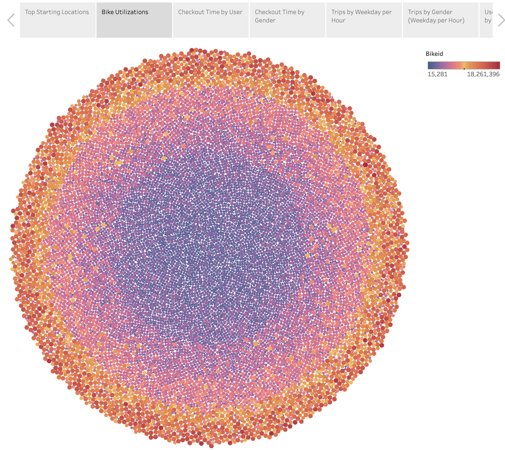

# bikesharing

[link to dashboard](https://public.tableau.com/app/profile/meg7530/viz/NYC_CitiBikes_16642028662200/NYCCitiBikes?publish=yes)

## Overview
The purpose of this analysis is to define and determine what months of the year a bike sharing business would be most successful, as well as what demographic groups it would be most successful with.

## Results

* Image depicting the top starting locations for bike sharing.

* Image depicting which bikes (by individual id) are most used.

* Image depicting the average amount of time each user used a bike.

* Image depicting the average duration of each ride by gender.

* Image depicting the duration of trips by each hour of the day by weekday.

* Image depicting the duration of trips by each hour of the day by weekday by gender.

* Image depicting the duration of trips by the subscriber status as well as gender by weekday.

## Summary
Going by the data presented by each images, the most business comes from a male, subscriber base, rather than either female customers or subscribers. The busiest times according to the images indicate that early morning and early evening are the times the subscriber base is most active. Possibly, this demographic is using the bike sharing service to commute to and from work or as a method of exercise. 

Two additional analyses could be to determine the age of the male/subscriber demographic specifically, as well as comparing the top starting and ending locations with the bikes that are most used, which could indicate whether there would be a need to provide more bikes to those areas as the populations there could be influenced by their peers to also use the bike service.
